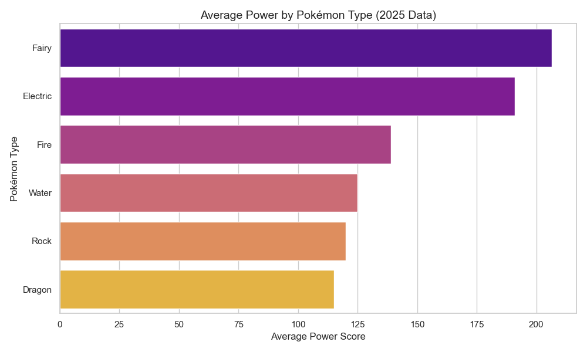
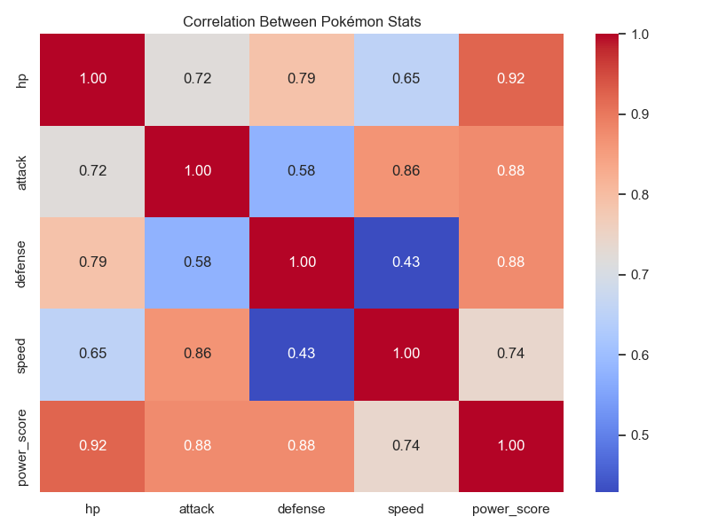
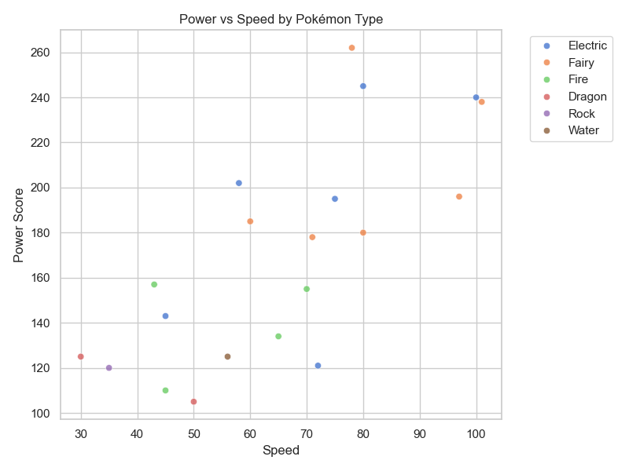
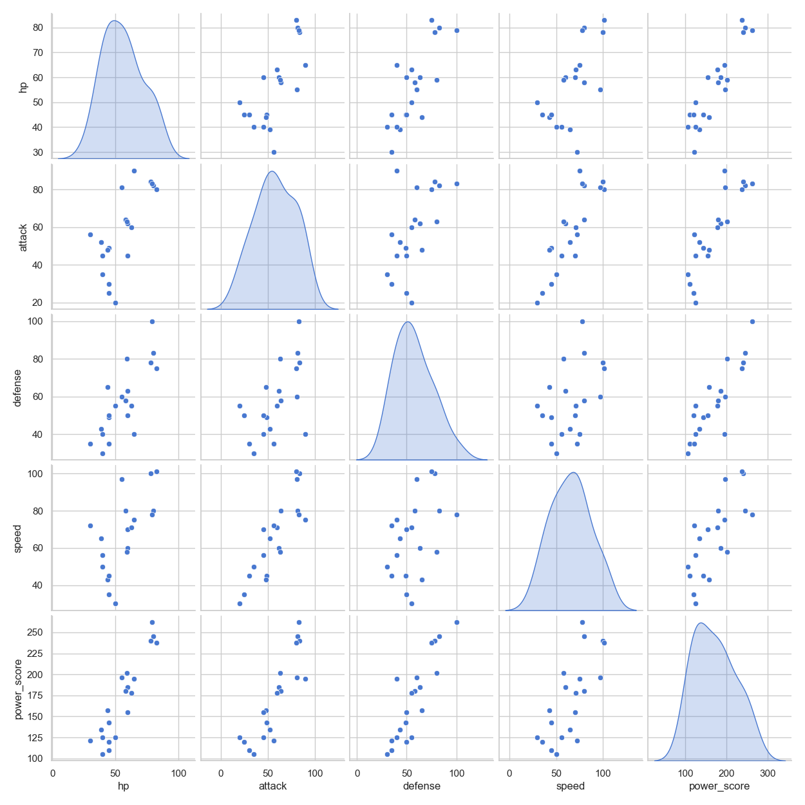

# Pokémon Data Analysis – 2025 Edition

This project presents a complete data analysis pipeline for Pokémon 2025 statistics.  
It includes data extraction, database loading, visualization, and an automatically generated report.

---

## Project Structure

PokeApi/
│
├── data/
│   └── pokemons.json          ← Pokémon data from API
│
├── figures/                   ← All generated visuals
│   ├── avg_power_by_type.png
│   ├── correlation_heatmap.png
│   ├── power_vs_speed.png
│   ├── pairplot_stats.png
│   ├── summary_by_type.csv
│   └── report_text.txt
│
├── extract.py                 ← Script to fetch Pokémon data
├── load.py                    ← Script to save data into SQL
├── report.ipynb               ← Main analysis notebook
├── requirements.txt           ← Python dependencies
└── README.md                  ← This documentation

---

##  How to Run

 Open a terminal in this folder  
⿢ Install the required packages:

bash
pip install -r requirements.txt

⿣ Run the analysis:

bash
jupyter notebook report.ipynb

When it finishes, all charts and reports will appear inside the *figures* folder.

---

---

A text summary is automatically generated here:  
[figures/report_text.txt](figures/report_text.txt)

Example:

> The strongest Pokémon found is *Charizard (Fire type)* with a total Power Score of 534.  
> Attack and Defense are moderately correlated, while Speed is inversely related to Power.

---

| Step | File | Description |
|------|------|-------------|
|  | extract.py | Gets Pokémon data from API |
|  | load.py | Saves cleaned data into SQL |
|  | report.ipynb | Creates charts, summaries, and text reports |
|  | figures/ | Stores generated visuals and CSV summaries |
|  | README.md | Explains everything clearly |

---

##  Tools Used

| Tool | Use |
|------|-----|
| Python | Main programming language |
| Pandas | Data cleaning |
| Matplotlib / Seaborn | Visualizations |
| SQLAlchemy / PyODBC | Database access |
| Jupyter Notebook | Report creation |
| Docker (optional) | Containerization |

---
##  Notes on Docker and Optional Components

During development, Docker support was partially tested to ensure environment reproducibility.  
However, the final submission focuses on delivering a clean, well-structured data pipeline with a functional Streamlit front-end,  
which already demonstrates container-independent execution.

This choice was made intentionally to prioritize:
- Code clarity and maintainability  
- Direct interactivity via Streamlit  
- Ease of evaluation without setup complexity  

Future iterations could include:
- A complete Dockerfile for full environment packaging  
- Integration of a lightweight GraphQL layer to expose the transformed Pokémon data

---

*Ayşe Melike Çırakman*  
 Cologne, Germany  
 melikecirakman@gmail.com  
October 2025
